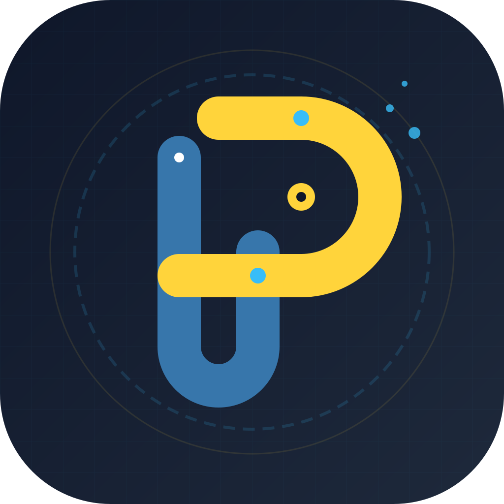

<div align="center">



# 🐍 Python Learning Journey

**My personal notes and practice code while learning Python — from the basics all the way to OOP, regex, SQLite, Flask, and an intro to AI & Data Science.**

[](https://www.python.org/)
[](https://flask.palletsprojects.com/)
[](https://www.sqlite.org/)
[](https://numpy.org/)
[](https://pandas.pydata.org/)
[](https://matplotlib.org/)

</div>

---

## 📖 What is this?

This repo is a running log of my Python learning path. Each folder is a topic, numbered in the order I studied it, and every file is a small, self-contained script with comments explaining the concept plus short examples and output — no fluff, just working code you can read top to bottom.

---

## 🧭 How it's organized

The core idea: **numbered topic folders = a linear curriculum.** Start at `01` and work your way up, or jump straight to whatever you're trying to learn.

| | Topic folders (`01`–`19`) | Mini projects (`20`) | Assignments |
|---|---|---|---|
| **What's inside** | One concept per file, with comments + examples | Small complete apps combining several concepts | Extra practice matched to a topic folder |
| **Best for** | Learning / reviewing a single concept | Seeing concepts used together | Testing yourself after a topic |
| **Difficulty** | Beginner → advanced, in order | Beginner → intermediate | Varies by folder |

```
01-basics-and-syntax  ──▶  ...  ──▶  17-advanced-topics
        │                                    │
        ▼                                    ▼
  18-web-development  ──▶  19-ai-and-data-science
                                              │
                                              ▼
                                    20-mini-projects
                                    (concepts combined)

              assignments/  ← extra practice, mirrors topic folders
```

---

## 📁 Structure

| Folder | Topic |
|---|---|
| [`01-basics-and-syntax`](./01-basics-and-syntax) | Variables, arithmetic operators, first steps |
| [`02-strings`](./02-strings) | String methods, `%` formatting, `.format()`, f-strings |
| [`03-operators`](./03-operators) | Comparison, membership, boolean, assignment operators, type conversion |
| [`04-data-structures`](./04-data-structures) | Lists, tuples, sets, dictionaries |
| [`05-control-flow`](./05-control-flow) | if / elif / else, nested if, ternary operator |
| [`06-loops`](./06-loops) | while & for loops, break/continue/pass |
| [`07-functions`](./07-functions) | Parameters, `*args`/`**kwargs`, scope, recursion, lambda, docstrings, type hints |
| [`08-file-handling`](./08-file-handling) | Reading/writing/appending files |
| [`09-modules-and-packages`](./09-modules-and-packages) | Built-in modules, custom modules, pip packages |
| [`10-datetime`](./10-datetime) | `datetime` module & formatting |
| [`11-iterators-and-generators`](./11-iterators-and-generators) | `iter()`, `next()`, generator functions |
| [`12-decorators`](./12-decorators) | Function decorators, practical speed test |
| [`13-builtin-functions`](./13-builtin-functions) | `map`, `filter`, `reduce`, `zip`, `enumerate`, `min`/`max`, Pillow intro |
| [`14-regular-expressions`](./14-regular-expressions) | Regex patterns, `re` module, practical email/account validator |
| [`15-oop`](./15-oop) | Classes, inheritance, polymorphism, encapsulation, `@property`, ABCs |
| [`16-database-sqlite`](./16-database-sqlite) | SQLite: connect, CRUD, queries, SQL injection notes |
| [`17-advanced-topics`](./17-advanced-topics) | `__name__ == "__main__"`, `timeit`, `logging`, `unittest` |
| [`18-web-development`](./18-web-development) | Flask intro, Selenium web scraping |
| [`19-ai-and-data-science`](./19-ai-and-data-science) | NumPy, Pandas, Matplotlib + Jupyter notebooks |
| [`20-mini-projects`](./20-mini-projects) | Small practice apps (password game, bookmark manager, bank system...) |
| [`assignments`](./assignments) | Extra practice/homework, organized by matching topic |

---

## 🗂️ `19-ai-and-data-science` breakdown

| Subfolder | Content |
|---|---|
| `00-python-review/` | Quick Python refresher (control flow, functions, OOP) |
| `numpy/` | Arrays, indexing, broadcasting, linear algebra |
| `pandas/` | Series, DataFrame, selection, missing data, groupby |
| `matplotlib/` | Line/scatter/bar/histogram/box/pie plots, subplots |
| `notebooks/` | Original `.ipynb` notebooks |

---

## 🛠️ Mini Projects (`20-mini-projects`)

| Project | Concepts used |
|---|---|
| Password guessing game | `while` loop, limited tries |
| Bookmark manager | `while` loop, lists |
| Account validator | Regular expressions |
| Bank account system | OOP, encapsulation |
| Skills manager | SQLite CRUD app |
| First Flask web app | Web development basics |

---

## ▶️ Running the code

Most files are standalone scripts — no project-wide setup needed:

```bash
git clone <your-repo-url>
cd python-learning-journey
python 01-basics-and-syntax/01-arithmetic-operators.py
```

Some folders need extra packages (Flask, Selenium, Pillow, NumPy, Pandas, Matplotlib). Install what a given file imports, e.g.:

```bash
pip install flask selenium pillow numpy pandas matplotlib
```

The `19-ai-and-data-science/notebooks/` files are Jupyter notebooks — open them with:

```bash
pip install notebook
jupyter notebook
```

---

## 📝 Notes

- Some scripts reference local file paths (e.g. `C:\Users\...`) from when they were written and tested on a local machine — they're kept as-is for learning reference.
- A couple of original files were blank in my notes and were left out of this repo.
- Assignments are organized by the topic they follow, not by number order — check the folder name to match it to its topic.

---

<div align="center">
<sub>⭐ Feel free to explore — this repo is mainly for my own tracking of progress, but hopefully useful for anyone learning Python too.</sub>
</div>
